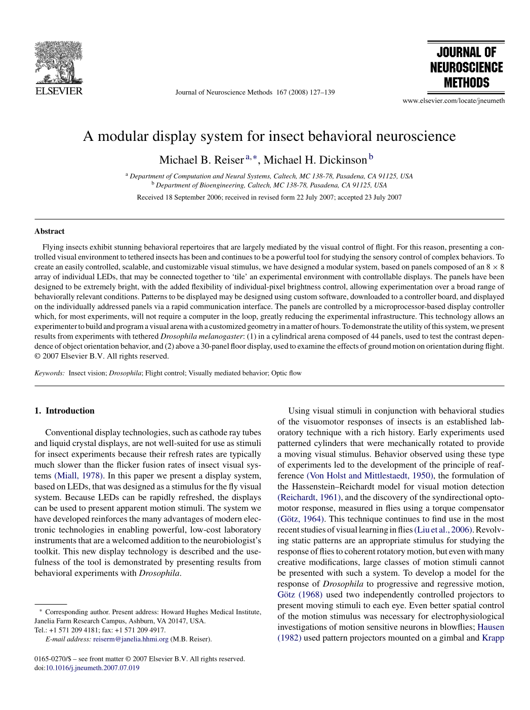

**Disclaimer:** This page is currently work in progress. If you want to get notified once we release this page or want to contribute, then please get in [contact](Contact).

# LED Arenas

[{: width="40%" .float-right}](https://doi.org/10.1016/j.jneumeth.2007.07.019)

LED-based systems offer a high level of control over the presentation of stimuli to model organisms. We document the ["modular display system for insect behavioral neuroscience"](https://doi.org/10.1016/j.jneumeth.2007.07.019) and its derivatives on this website. Major revisions to the systems are known as "Generations". Here we focus on [Generation 3](Generation 3) and [Generation 4](Generation 4), with a brief outlook to [Generation 5](Generation 5).

In the past 15 years of development, progress has been documented in various publications and locations. This page has two main goals: First, it is an attempt to collect these technical details and user guides in a single location. This part of the documentation takes the form of a data dump at times, but please feel encouraged to get in touch if you have questions, ideas for improvement or your experience differs from the description. Secondly, this page attempts to provide an infrastructure for active developers and users to document the arenas and their use with the least possible effort. This page is currently generated from a hand full of code repositories. If you have documentation about the LED systems, related tools, or applications, please [reach out](Contact).

Currently, [Generation 3](Generation 3) is being used in many installations around the world. [Generation 4](Generation 4) arenas are being used at Janelia, and methods papers are currently in preparation. [Generation 5](Generation 5) is presently being developed.

# Repositories

This page includes documentation from the following repositories:


- [{{repo.path}}]({{repo.url}}) (forked from [this upstream]({{repo.upstream}})) 

